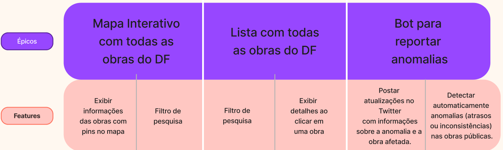

# Documento de Requisitos

## 1.0 Introdução

### 1.1 Objetivo
Este documento especifica os requisitos para o desenvolvimento do projeto **Mapeamento de Obras** do grupo 07, parte da disciplina de **Métodos de Desenvolvimento de Software 2024.2**.  
O objetivo do projeto é exibir dados de obras públicas do Distrito Federal por meio de um mapa interativo.

### 1.2 Escopo
O sistema será uma aplicação web que:  
- Apresenta obras públicas do DF utilizando um mapa interativo.  
- Coleta dados fornecidos pela **API ObrasGov** e os insere em um mapa da biblioteca **Leaflet**.  
- Oferece recursos de visualização, detalhamento e filtros para facilitar o acesso às informações.

### 1.3 Tecnologias Utilizadas
- **Front-end:** HTML, CSS, JavaScript e Leaflet  
- **API:** ObrasGov  

---

## 2. Descrição Geral

### 2.1 Visão Geral do Sistema
O sistema permitirá que os usuários visualizem um mapa interativo com pinos representando obras públicas.  
Ao clicar em um pino, os detalhes da obra serão exibidos.  
O sistema incluirá funcionalidades de filtros para personalizar as informações exibidas.

### 2.2 Objetivos do Usuário
- Visualizar obras públicas em andamento, concluídas ou inacabadas.  
- Acessar informações detalhadas das obras, como valores, datas e status.  
- Filtrar obras por região, status ou período de execução.  

---

## 3. Requisitos Funcionais

Os requisitos foram organizados em épicos e suas respectivas features:

### 3.1 Épico: Mapa Interativo de Obras
- **Feature:** Exibir um pino no mapa para cada obra com informações detalhadas, incluindo:  
  - Nome da obra  
  - Valor investido  
  - Data de início e previsão de término  
  - Status da obra  

- **Feature:** Filtros de pesquisa no mapa por:  
  - Status da obra
  - Nome da obra
  - Prazo de entrega da obra

### 3.2 Épico: Lista Detalhada de Obras Públicas
- **Feature:** Ao clicar em uma obra na lista, serão exibidos todos os seus detalhes, como:  
  - Nome da obra  
  - Responsáveis pela obra  
  - Status da obra  
  - Prazo de entrga da obra 

- **Feature:** Filtros de pesquisa na lista por:  
  - Status da obra 
  - Nome  da obra
  - Prazo de entrega da obra

### 3.3 Épico: Bot para Reportar Anomalias
- **Feature:** Detectar automaticamente anomalias (atrasos ou inconsistências) nas obras.  
- **Feature:** Postar atualizações no Twitter com informações da anomalia identificada na respectiva obra.  

---

## 4. Requisitos Não-Funcionais

### 4.1 Usabilidade
- A interface deve ser **intuitiva e amigável**, com elementos visuais organizados logicamente.  
- O design deve ser **responsivo**, garantindo uma boa experiência em diferentes dispositivos (desktop, tablet, mobile).  
- O sistema deve facilitar a navegação e o uso das funcionalidades.  

---

## 5. User Story Map

Para organizar e visualizar melhor os requisitos do projeto, foi elaborado um **User Story Map** no Figma.  
Este mapa divide os requisitos em **épicos** e **features**, com a previsão de adicionar, futuramente, as **histórias de usuários**.

[Visualizar o mapa no Figma](https://www.figma.com/board/xAOzOYBkiF8Bqr9fmzCSi6/Projeto-MDS?node-id=0-1&t=J91aSFDpirGDqG4v-1)

Será incluída abaixo uma ilustração exemplificando sua estrutura:

_Figura 1: Exemplo do User Story Map_

